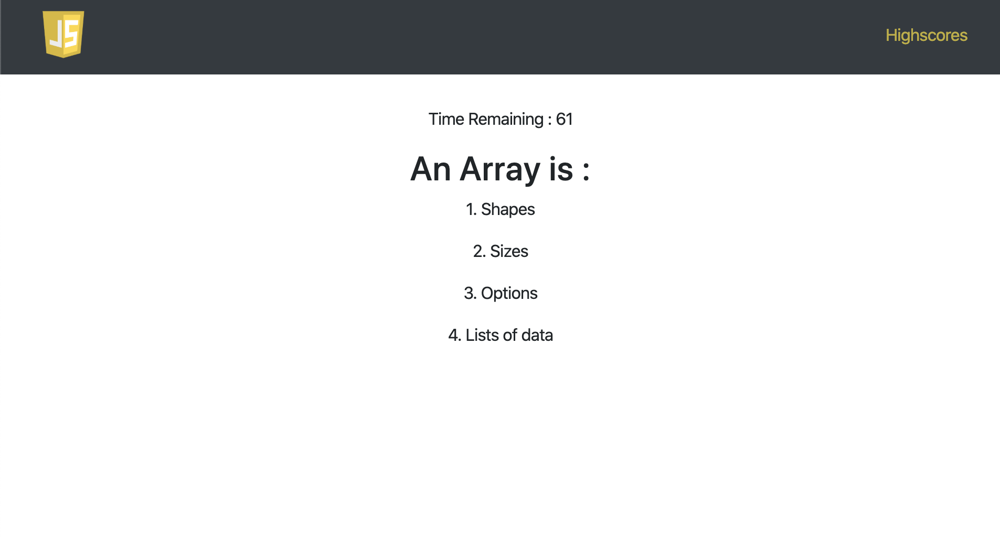

# JS-Quiz

A simple questionnaire application which will give you score based on how fast you answer the questions. 
Each wrong answer will deduct 10 from your total. 

## Assignment 4 : UofT Cooding Bootcamp

The assignment focusses on using localStorage to save and retrieve values. 
Questions can also be added additionally to the questions.js file 

Click to check out : https://ianasqazi.github.io/JS-Quiz/

## Screenshots 

### Start Page 

### Questions Page 

### Save Scores Page

### Highscores Page 

## Languages Used 

* HTML 
* CSS
* Javascript

## Libraries used 

* Bootstrap
